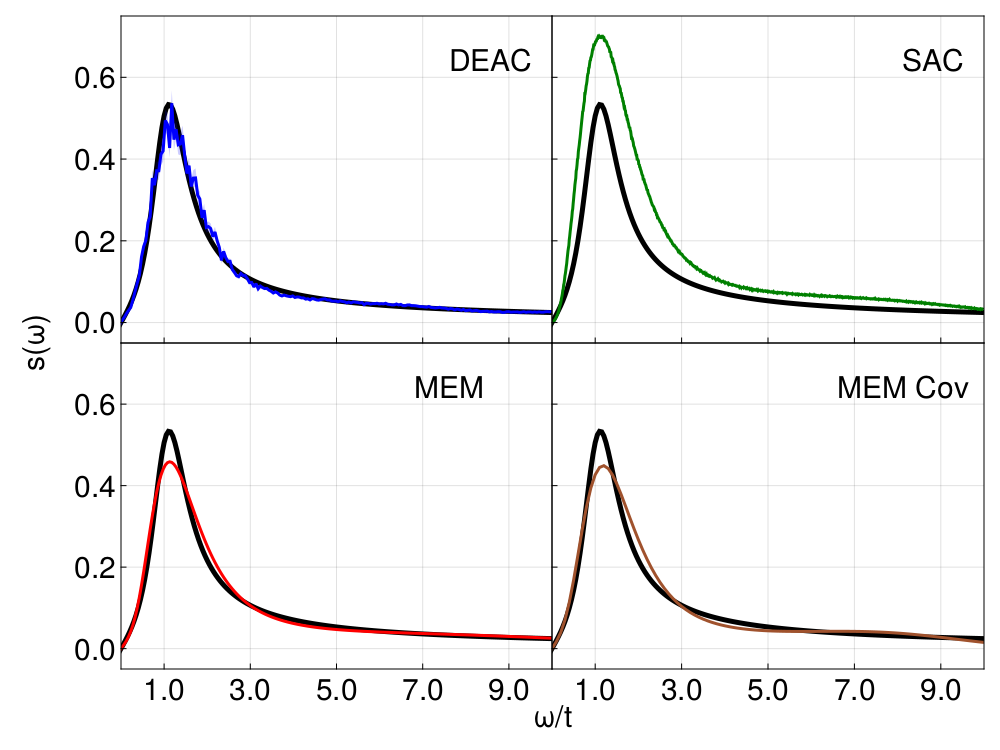

# SmoQyDEAC.jl Paper Scripts
Repository of code used to generate plots for SmoQyDEAC.jl's paper [arXiv:TBD](https://arxiv.org/abs/FIXME). This is a reimplementation of the DEAC algorithm developed by Nathan S. Nichols, Paul Sokol, and Adrian Del Maestro [arXiv:2201.04155](https://arxiv.org/abs/2201.04155).

Other software needed for these scripts:
- [`ACFlow`](https://github.com/huangli712/ACFlow): Li Huang's Analytic Continuation package
- [`SAC`](https://github.com/JefferyWangSH/sac): Jeffrey Wang's implementation of Stochastic Analytic Continuation
- [`SynthAC`]( https://github.com/sandimas/SynthAC.jl): Package to convert spectral functions to Matsubara space 

For questions and comments regarding these scripts, please email James Neuhaus at [jneuhau1@utk.edu](mailto:jneuhau1@utk.edu).
# Funding
This work was supported by the U.S. Department of Energy, Office of Science, Office of Basic Energy Sciences, under Award Number DE-SC0022311. N.S.N. was supported by the Argonne Leadership Computing Facility, which is a U.S. Department of Energy Office of Science User Facility operated under contract DE-AC02-06CH11357. 

# Comparison Plots
Our paper included a few representative cases for usage of SmoQyDEAC.jl. All 10 tested distributions are accounted for here, for completeness. See "1_MakeDistributions.jl" in comparisons subfolders for true distributions tested.
## Additional Fermion Plots

## Additional Boson (symmetric) Plots

